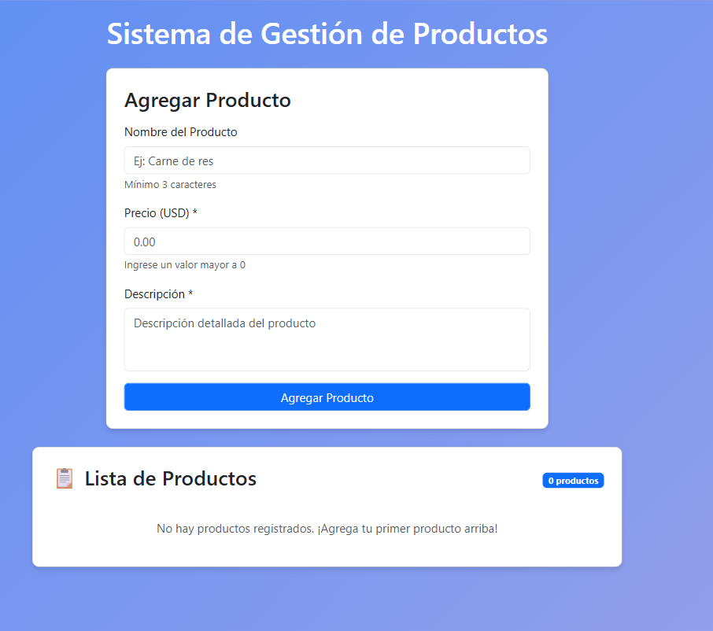
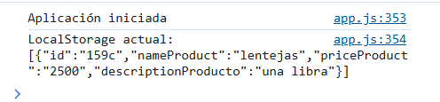
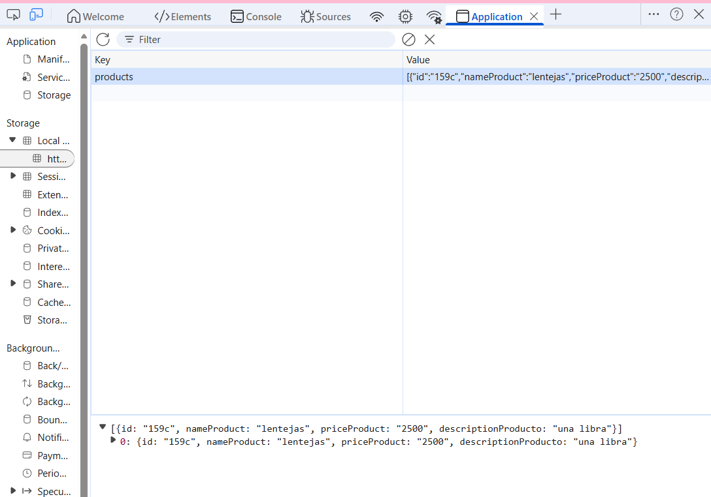

# Sistema de Gestión de Productos - CRUD Completo

Proyecto que implementa un sistema CRUD (Create, Read, Update, Delete) completo para gestión de productos, integrando **DOM**, **LocalStorage** y **Fetch API**.

---

## ✅ TAREAS COMPLETADAS

### **TASK 1: Estructura del proyecto**
- ✅ `index.html`: Estructura HTML con formulario y lista
- ✅ `app.js`: Lógica completa de la aplicación
- ✅ Código comentado y organizado
- ✅ Archivos correctamente enlazados

### **TASK 2: Captura e interacción con el usuario**
- ✅ Captura de datos mediante formulario HTML
- ✅ Validación de campos en JavaScript:
  - Campos no vacíos
  - Precio debe ser número positivo
  - Nombre mínimo 3 caracteres
- ✅ Mensajes dinámicos de éxito/error en el DOM
- ✅ Mensajes con temporizador (desaparecen en 3 segundos)

### **TASK 3: Manipulación dinámica del DOM**
- ✅ Creación dinámica de elementos `<li>` para cada producto
- ✅ Botones "Eliminar" y "Editar" en cada producto
- ✅ Uso de `appendChild()` para agregar elementos
- ✅ Uso de `filter()` para eliminar elementos del array
- ✅ Renderización completa de la lista al agregar/eliminar/editar

### **TASK 4: Persistencia en Local Storage**
- ✅ Arreglo global `products` para almacenar datos
- ✅ Uso de `localStorage.setItem()` para guardar
- ✅ Uso de `localStorage.getItem()` para recuperar
- ✅ Sincronización automática entre API y LocalStorage
- ✅ Datos persisten entre sesiones del navegador
- ✅ Fallback a LocalStorage si la API no está disponible

### **TASK 5: Integración con Fetch API**
- ✅ **GET**: Obtener lista de productos al cargar la página
- ✅ **POST**: Agregar nuevos productos
- ✅ **PUT**: Actualizar productos existentes
- ✅ **DELETE**: Eliminar productos
- ✅ Uso de `async/await` en todas las operaciones
- ✅ Manejo de errores con `try...catch`
- ✅ Logs en consola de todas las operaciones
- ✅ Respuestas del servidor mostradas en consola

### **TASK 6: Validaciones y pruebas finales**
- ✅ Todas las funcionalidades integradas
- ✅ Sincronización completa: DOM ↔ LocalStorage ↔ API
- ✅ Validaciones de entrada implementadas
- ✅ Manejo robusto de errores
- ✅ Mensajes informativos al usuario

---

## 🚀 Instrucciones de Uso

### **Requisitos previos**
1. **Node.js** instalado
2. **JSON Server** instalado globalmente:
   ```bash
   npm install -g json-server
   ```

### **Pasos para ejecutar**

1. **Iniciar el servidor JSON:**
   ```bash
   json-server --watch db.json --port 3000
   ```
   
2. **Abrir el proyecto:**
   - Abre `index.html` en tu navegador
   - O usa Live Server en VS Code

3. **Probar las funcionalidades:**
   - ✅ Agregar productos
   - ✅ Editar productos (click en "Editar")
   - ✅ Eliminar productos (click en "Eliminar")
   - ✅ Recargar la página (los datos persisten)

---

## 🔍 Capturas y Evidencias

### **1. Consola del navegador (F12)**
Verás logs de:
- "Aplicación iniciada"
- "Productos cargados correctamente"
- "Producto guardado: {...}"
- "Producto actualizado: {...}"
- "Elemento eliminado: [id]"

### **2. LocalStorage**
Para verificar:
1. Abre DevTools (F12)
2. Ve a la pestaña "Application" > "Local Storage"
3. Verás la clave `products` con el array de productos

### **3. Respuestas de la API**
En la pestaña "Network" (Red) verás:
- GET http://localhost:3000/products
- POST http://localhost:3000/products
- PUT http://localhost:3000/products/:id
- DELETE http://localhost:3000/products/:id

---

## 📊 Operaciones CRUD

| Operación | Método HTTP | Descripción |
|-----------|-------------|-------------|
| **CREATE** | POST | Agregar nuevo producto |
| **READ** | GET | Obtener lista de productos |
| **UPDATE** | PUT | Actualizar producto existente |
| **DELETE** | DELETE | Eliminar producto |

---

## 🎯 Características Destacadas

### **Validaciones implementadas:**
- ✅ Campos obligatorios
- ✅ Precio debe ser > 0
- ✅ Nombre mínimo 3 caracteres
- ✅ Confirmación antes de eliminar

### **Sincronización triple:**
```
DOM ↔ LocalStorage ↔ API
```

### **Manejo de errores:**
- Si la API no está disponible, carga desde LocalStorage
- Mensajes claros de error al usuario
- Logs detallados en consola

### **UX Mejorada:**
- Mensajes temporales (3 segundos)
- Confirmación antes de eliminar
- Botón cambia a "Actualizar" al editar
- Contador de productos en tiempo real
- Scroll automático al editar

---

## 🛠️ Tecnologías Utilizadas

- **HTML5**: Estructura semántica
- **CSS3**: Bootstrap 5.3.8
- **JavaScript ES6+**: 
  - `async/await`
  - Arrow functions
  - Template literals
  - Destructuring
  - `let` y `const`
- **Fetch API**: Comunicación con servidor
- **LocalStorage**: Persistencia local
- **JSON Server**: API REST simulada

---

## 📝 Estructura de un Producto

```javascript
{
  "id": "cf59",                    // Generado por JSON Server
  "nameProduct": "Laptop Dell",    // String
  "priceProduct": "999.99",        // String (número)
  "descriptionProducto": "..."     // String
}
```

---

## 🐛 Solución de Problemas

### **Error: No se pueden cargar productos**
- ✅ Verifica que JSON Server esté corriendo
- ✅ Comprueba la URL: `http://localhost:3000/products`

### **Los datos no persisten**
- ✅ Verifica la consola (F12) para errores
- ✅ Revisa LocalStorage en DevTools

### **Botón "Editar" no funciona**
- ✅ Asegúrate de que el producto tenga un `id` válido

---

## 📚 Referencias

- [Fetch API - MDN](https://developer.mozilla.org/es/docs/Web/API/Fetch_API)
- [LocalStorage - MDN](https://developer.mozilla.org/es/docs/Web/API/Window/localStorage)
- [JSON Server](https://github.com/typicode/json-server)
- [Bootstrap 5](https://getbootstrap.com/)

---

## ✨ Mejoras Futuras

- [ ] Paginación de productos
- [ ] Búsqueda y filtros
- [ ] Exportar a CSV/PDF
- [ ] Validación de imágenes
- [ ] Modo oscuro
- [ ] Ordenamiento de columnas

---

**Desarrollado como proyecto de aprendizaje de JavaScript ES6+**

**Fecha**: 2026

**El DOM antes y después de una operación.**



**La consola mostrando las respuestas del servidor.**


**El contenido del Local Storage.**
